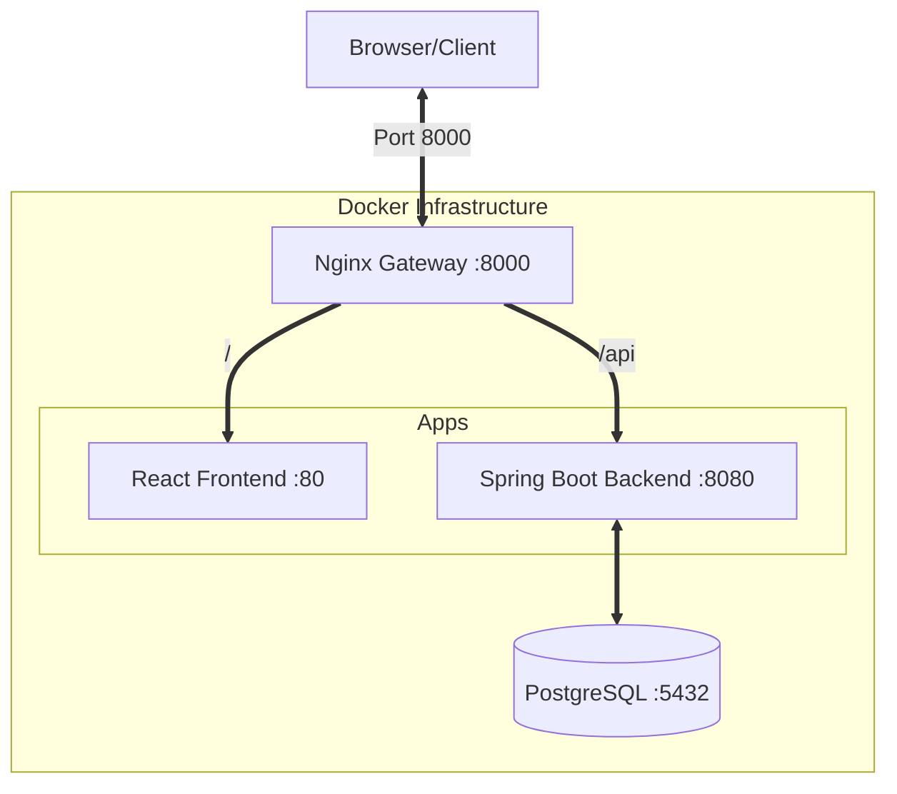

# 🏗️ SmartReception Monorepo Architecture Guide

This guide describes the production-grade manual monorepo setup for **SmartReception**.

---

## 📂 1. Directory Structure

A clean separation between applications, infrastructure, and CI/CD.



```text
Smart_Reception/
├── apps/
│   ├── backend/                # Java Spring Boot (REST API)
│   │   ├── src/                # Spring Layered logic (Controller, Service, Repository)
│   │   ├── pom.xml             # Maven configuration
│   │   └── Dockerfile          # Multi-stage image build
│   └── frontend/               # React + Vite (Web UI)
│       ├── src/                # Components and Hooks
│       ├── vite.config.ts      # API Proxying
│       └── Dockerfile          # Nginx-based image build
├── infrastructure/             # DevOps config
│   └── docker/
│       └── nginx/              # Reverse Proxy configuration
├── .github/                    # CI/CD Workflows
├── docker-compose.yml          # Local environment orchestration
└── README.md
```

---

## ☕ 2. Backend Design (Spring Boot)

The backend uses a standard **Layered Architecture**:
-   **API Layer**: REST Controllers using OpenAPI (Swagger) annotations.
-   **Service Layer**: Business logic and transaction management.
-   **Repository Layer**: Spring Data JPA for PostgreSQL interaction.
-   **Model Layer**: JPA Entities with UUID identifiers.

### Environment Handling
We use the default `application.properties` for development and override it with Docker Compose environment variables in production-like environments.

---

## ⚛️ 3. Frontend Design (React)

Built with **Vite** and **React 19**, the frontend is configured to communicate with the backend seamlessly:
- **Proxy**: During development, Vite proxies `/api` requests to `localhost:8080`.
- **Nginx**: In production, the Nginx container serves static assets and routes API traffic.

---

## 🐳 4. Orchestration & Local Dev

Run the whole stack with:
```bash
docker-compose up --build
```
- **Port 8000**: Access the system via the Nginx Gateway (simulates production).
- **Port 8080**: Access the Backend directly (for debugging).
- **Port 5432**: PostgreSQL access.

---

## 🚀 5. Scaling & Best Practices

1.  **Observability**: Output logs in JSON format for production ELK/Grafana integration.
2.  **Statelessness**: The backend is stateless, allowing for horizontal scaling behind a load balancer.
3.  **Client Generation**: We recommend generating the API client from the backend's OpenAPI spec to maintain type safety across the monorepo.
