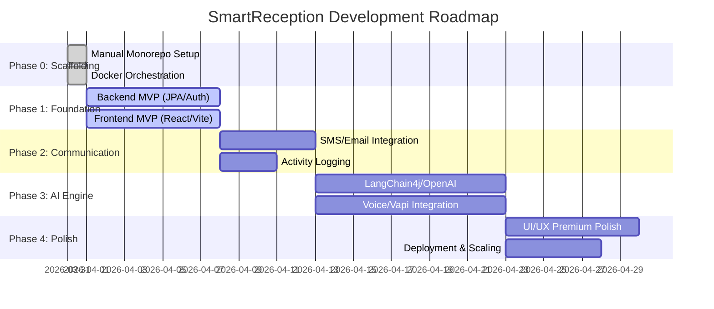

# 🗺️ Project Roadmap - SmartReception

This roadmap outlines the development plan for the AI Hospital Smart Reception System.

---

---

## Phase 0: Scaffolding (Manual Monorepo) ⚙️
*Goal: Initialize the workspace and generate baseline apps without Nx.*
- [x] Initial Directory Structure (`/apps`, `/infrastructure`, `/packages`).
- [x] Backend Setup: Spring Boot 3.2+ with Maven in `apps/backend`.
- [x] Frontend Setup: React + Vite + TypeScript in `apps/frontend`.
- [x] Dockerization: Multi-stage Dockerfiles for both services.
- [x] Orchestration: Root `docker-compose.yml` for DB, Backend, and Nginx.
- [x] CI/CD: GitHub Actions workflow for automated builds.

---

## Phase 1: Foundation (The MVP Core) 🛠️
*Goal: A working appointment system with manual receptionist oversight.*

### Backend (Spring Boot)
- [ ] Initialize project with Spring Boot 3.x, JPA, and PostgreSQL.
- [ ] Implement Security: JWT-based Authentication (Roles: `RECEPTIONIST`, `DOCTOR`, `MANAGER`).
- [ ] Database Schema: CRUD for Patients, Doctors, and Appointments.
- [ ] Appointment Logic: Conflict checking (don't book two people for one doctor at the same time).
- [ ] Real-time Socket: Set up WebSockets to broadcast new appointment notifications.

### Frontend (React + Tailwind)
- [ ] Set up project with Vite + React + Tailwind CSS.
- [ ] Create Authentication pages (Login/Logout).
- [ ] Dashboard Shell: Main layout with Sidebar navigation.
- [ ] Appointment Calendar View: A visual grid or list of the day's appointments.
- [ ] Booking Form: Modal for manual booking by the receptionist.

---

## Phase 2: Communication & Logging (The "Smart" Base) 📩
*Goal: Automate notifications and logs for all activities.*

### Backend
- [ ] Integration: Connect Twilio (SMS) and SendGrid (Email).
- [ ] Messaging Service: Send automated reminders 24h before appointments.
- [ ] Activity Logger: Interceptor to record every system action (who did what and when).
- [ ] Conversation Repository: Store SMS and Email threads linked to a patient UUID.

### Frontend
- [ ] Activity Feed: A scrolling "Live Activity Log" components on the dashboard.
- [ ] Conversation View: UI to read through historical SMS/Email interaction threads.
- [ ] Staff Notification: Visual toast/alert popup when a patient sends a message or books.

---

## Phase 3: AI Integration (The Advanced Layer) 🤖
*Goal: 24/7 automated voice and text handling.*

### Backend
- [ ] AI Service Integration: Set up LangChain4j with OpenAI.
- [ ] NLU: logic to parse "I want to cancel" from text messages.
- [ ] Voice Flow: Integrate Vapi/Twilio-Media-Streams with a STT/TTS pipeline.
- [ ] Multi-language: Language detection logic based on patient's spoken/written input.

### Frontend
- [ ] AI Insights: Display "Sentiment" emoji next to conversations (🙂, 😠, ❓).
- [ ] Live Call Logs: Display transcriptions of ongoing AI voice calls in real-time.
- [ ] Role Specific Views:
  - [ ] Doctor: Schedule-only focus.
  - [ ] Manager: Analytics on AI success rate (calls resolved vs. escalated).

---

## Phase 4: Polish & Scale (Premium UX) ✨
*Goal: Wow factors, performance, and cross-platform readiness.*

- [ ] UI Micro-animations: Add subtle Frramer Motion transitions for state changes.
- [ ] Theming: Full Dark/Light mode support.
- [ ] Analytics Dashboard: Graphs showing "Peak Calling Hours" and "Doctor Workload".
- [ ] Deployment: Dockerize both FE and BE for cloud hosting.
- [ ] Offline Support: PWA features for the staff dashboard as an app-like experience.

---

## 📈 Success Metrics
1. **Response Time:** AI responds to calls/messages in under 2 seconds.
2. **Efficiency:** Reduction in receptionist manual data entry by 70%.
3. **Satisfaction:** High patient sentiment scores in the AI analytics.

---

💡 *Note: Tasks are designed for parallel development (BE and FE teams can work on matching features simultaneously).*
