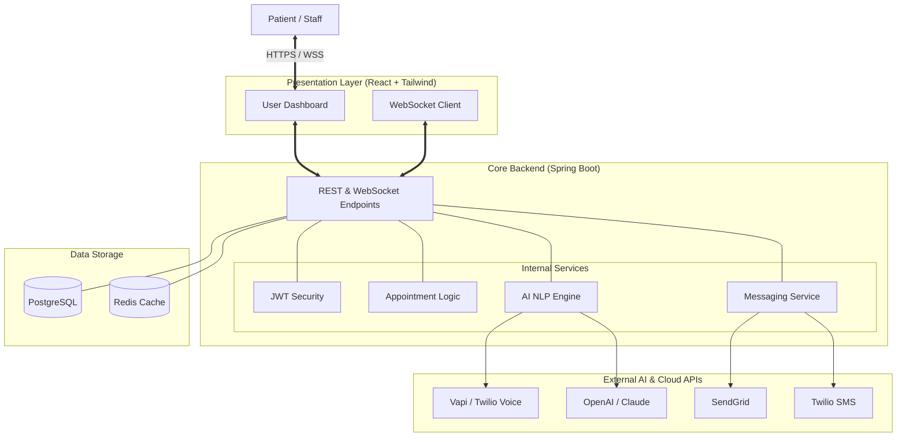
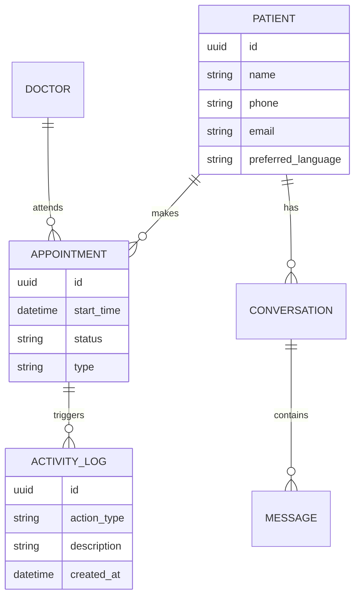

# 🏗️ SYSTEM_DESIGN.md - SmartReception

## 📌 Introduction
SmartReception is a state-of-the-art AI-driven hospital reception system. It integrates traditional hospital management with cutting-edge AI to automate patient interactions via Voice, SMS, and Email.

---

## 🏛️ High-Level Architecture

### Monorepo Orchestration: Nx
The system follows an **Nx-powered Monorepo** architecture. This ensures that the frontend and backend share a unified workspace, benefit from Nx's caching and dependency tracking, and use a consistent command interface.

### Workspace Structure
```text
/Smart_Reception
  ├── apps/
  │   ├── client/         # React + Tailwind
  │   └── server/         # Spring Boot (Managed via @nxrocks/nx-spring-boot)
  ├── nx.json             # Monorepo configuration
  ├── docker-compose.yml  # Shared infrastructure
  └── ...
```

---

## ⚙️ Initialization & Build Guide (Nx Workspace)

To set up this Nx monorepo from scratch:

### 1. Unified Workspace Initialization
*   **Command:** `npx create-nx-workspace@latest Smart_Reception --preset=apps`
*   **Manager:** Nx CLI

### 2. Backend: Java Spring Boot (via Nx Plugin)
*   **Plugin:** `@nxrocks/nx-spring-boot`
*   **Command:** `nx g @nxrocks/nx-spring-boot:project server --projectType=application`
*   **Dependencies:** Web, JPA, Security, Postgres, Lombok, LangChain4j.

### 3. Frontend: React + Tailwind CSS
*   **Command:** `nx g @nx/react:app client --bundler=vite --style=css`
*   **Styling:** Follow standard Nx Tailwind setup.

### 4. Build & Run (Nx Way)
*   **Run All:** `nx run-many --target=serve`
*   **Build All:** `nx run-many --target=build`

---



---

## 🛠️ Technology Stack

| Layer | Technology | Rationale |
| :--- | :--- | :--- |
| **Frontend** | React 18, Tailwind CSS, TanStack Query | Responsive, premium UI with efficient state management. |
| **Backend** | Java 17+, Spring Boot 3.x | Robust, scalable, and industry-standard for healthcare. |
| **Database** | PostgreSQL | Relational data integrity for appointments and logs. |
| **Real-time** | Spring WebSockets (STOMP) | Live activity feeds and instant staff notifications. |
| **AI / NLP** | OpenAI GPT-4o / LangChain4j | Advanced NLU and emotional intelligence. |
| **Voice/SMS** | Twilio / Vapi.ai | Reliable global communication infrastructure. |
| **Security** | Spring Security + JWT | Role-based access control (Doctor, Receptionist, Manager). |
| **DevOps** | Docker & Docker Compose | Consistent development and production environments. |

---

## 🧩 Key Modules

### 1. AI Orchestrator
This module handles the logic for voice and text-based AI.
- **Intent Recognition:** Parses "I want to see Dr. Smith tomorrow" into a structured booking request.
- **Sentiment Analysis:** Detects frustration or urgency to adapt the AI's tone.
- **STT/TTS Pipeline:** Manages the conversion between audio streams and text.

### 2. Communication Engine
A unified interface for all outbound/inbound patient contact.
- **Multi-channel:** Switches between SMS, Email, and Voice seamlessly.
- **Templating:** Uses Handlebars/Thymeleaf for dynamic, localized notification templates.

### 3. Real-time Notification Node
Uses WebSockets to push "Events" to the staff dashboards.
- **Event Bus:** Every database change (appointment created, call received) emits an event.
- **Priority Queue:** Critical events (e.g., patient emergency mentioned in AI call) get priority.

---

## 🗄️ Database Schema (Conceptual)



---

## 🔒 Security & Compliance
- **HIPAA Compliance Readiness:** Data encryption at rest (AES-256) and in transit (TLS 1.3).
- **Audit Logs:** Every interaction and system change is logged with a timestamp and user ID.
- **RBAC:** Strict access controls ensuring Doctors only see relevant patient history.

---

## 🚀 Scalability Plan
- **Horizontal Scaling:** Spring Boot instances behind an Nginx Load Balancer.
- **Async Processing:** Using Spring `@Async` or RabbitMQ for heavy tasks like sending bulk emails or processing long AI transcripts.
- **Caching:** Redis for frequently accessed doctor schedules to reduce DB load.
